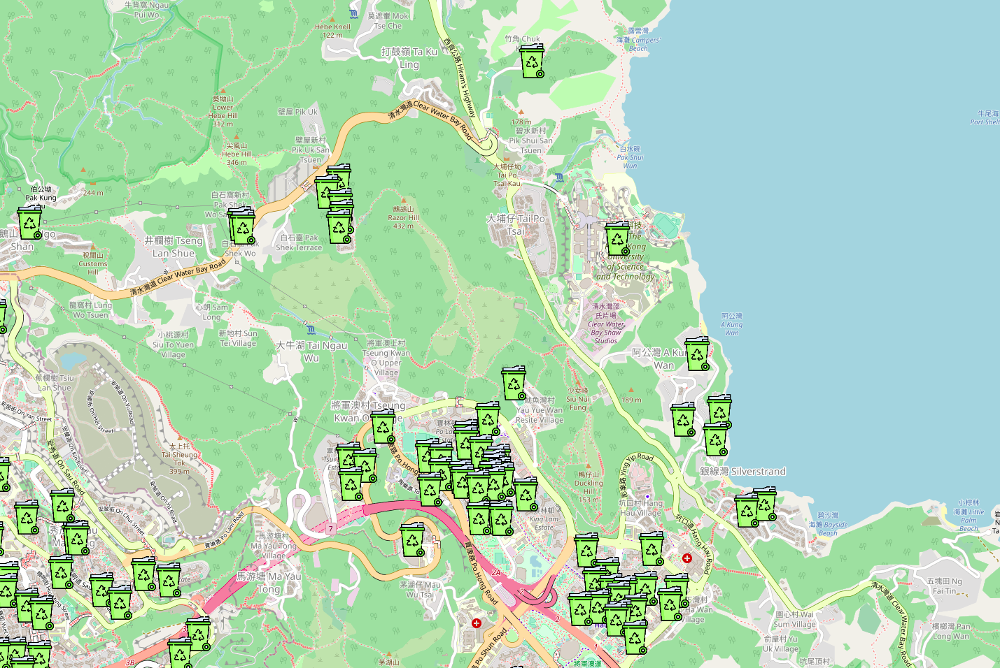
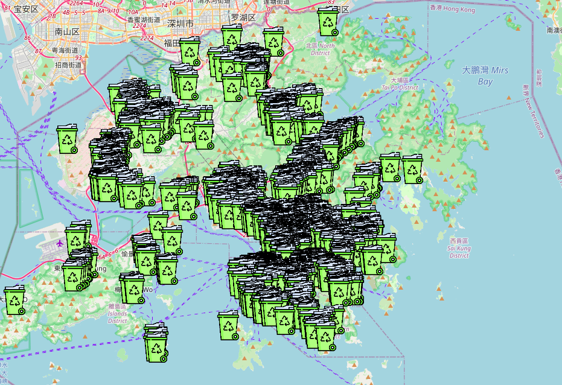

# ENVS5112_rechargeable_battery
With the rapid development of electric vehicles and consumer products, the demand for lithium-ion batteries has increased dramatically. Thus, we evaluated the environmental impact of rechargeable battery industry in Greater Bay area and focused on hazard identification process, risk assessment and management as well as mitigation and recycling. 

I mainly responsible for the project background and hazard identification process. In addition, a visualization of rechargeable collection points in Hong Kong based on Python and OpenStreetMap is presented.
## Flowchart
<p align="center">
  
</p>

[Hong Kong Geodata Store](https://geodata.gov.hk/gs/) is a public platform for exploring and downloading open spatial data in support of smart city development in Hong Kong. 

## Dependencies

```shell script

pip3 install flask folium
```


## Show Cases

http://18.141.185.21:8888, depolyed in AWS and tested in Chrome.

### HKUST collection points

<p align="center">
  
</p>

### Hong Kong collection points
<p align="center">
  
</p>
